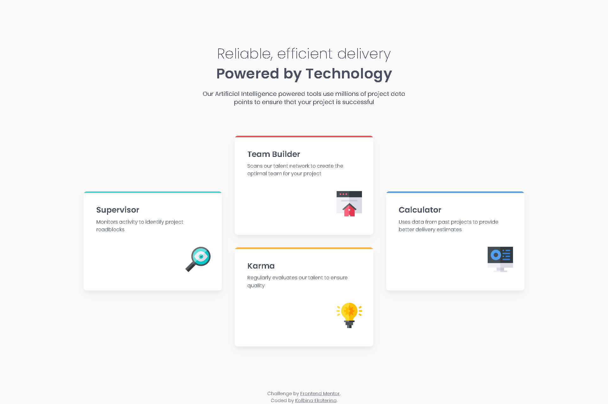
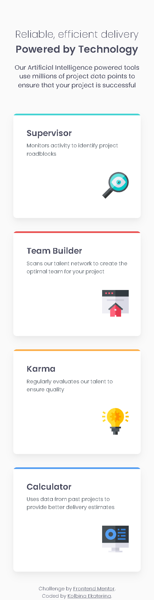

# Frontend Mentor - Four card feature section solution

This is a solution to the [Four card feature section challenge on Frontend Mentor](https://www.frontendmentor.io/challenges/four-card-feature-section-weK1eFYK). Frontend Mentor challenges help you improve your coding skills by building realistic projects.

## Table of contents

- [Overview](#overview)
  - [The challenge](#the-challenge)
  - [Screenshot](#screenshot)
  - [Links](#links)
- [My process](#my-process)
  - [Built with](#built-with)
  - [What I learned](#what-i-learned)
- [Author](#author)
- [Acknowledgments](#acknowledgments)

## Overview

### The challenge

Users should be able to:

- View the optimal layout for the site depending on their device's screen size

### Screenshot

### Links

- Solution URL: [https://github.com/Ekaterina-alekse/four-card-feature-section](https://github.com/Ekaterina-alekse/four-card-feature-section)
- Live Site URL: [https://ekaterina-alekse.github.io/four-card-feature-section](https://ekaterina-alekse.github.io/four-card-feature-section)

## My process

### Built with

- Semantic HTML5 markup
- CSS custom properties
- Flexbox
- CSS Grid
- Mobile-first workflow

### What I learned

In this project, I practiced CSS Grid for complex desktop layouts using `grid-area`.

## Author

- GitHub - [Ekaterina-alekse](https://github.com/Ekaterina-alekse)
- Frontend Mentor - [@Ekaterina-alekse](https://www.frontendmentor.io/profile/Ekaterina-alekse)

## Acknowledgments

Thanks to Frontend Mentor for providing this challenge and helping developers improve their skills through realistic projects.

---

# Решение задачи Frontend Mentor - Секция с четырьмя карточками функций

Это решение задачи [Four card feature section challenge on Frontend Mentor](https://www.frontendmentor.io/challenges/four-card-feature-section-weK1eFYK). Задачи Frontend Mentor помогают улучшать навыки программирования, создавая реалистичные проекты.

## Обзор

### Задача

Пользователи должны уметь:

- Видеть оптимальный макет в зависимости от размера экрана

### Скриншоты

### Ссылки

- Репозиторий: [https://github.com/Ekaterina-alekse/four-card-feature-section](https://github.com/Ekaterina-alekse/four-card-feature-section)
- Живая версия: [https://ekaterina-alekse.github.io/four-card-feature-section](https://ekaterina-alekse.github.io/four-card-feature-section)

## Мой процесс

### Использованные технологии

- Семантическая разметка HTML5
- CSS-переменные
- Flexbox
- CSS Grid
- Mobile-first подход

### Что я узнала

В этом проекте я применила CSS Grid для сложной десктопной раскладки с использованием `grid-area`.

## Автор

- GitHub - [Ekaterina-alekse](https://github.com/Ekaterina-alekse)
- Frontend Mentor - [@Ekaterina-alekse](https://www.frontendmentor.io/profile/Ekaterina-alekse)

## Благодарности

Спасибо Frontend Mentor за этот челлендж и возможность улучшать свои навыки через реалистичные проекты.